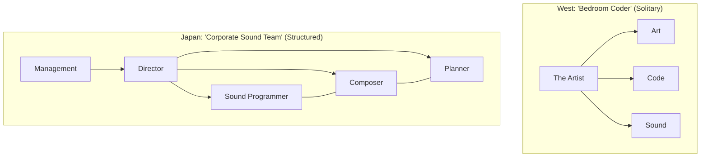
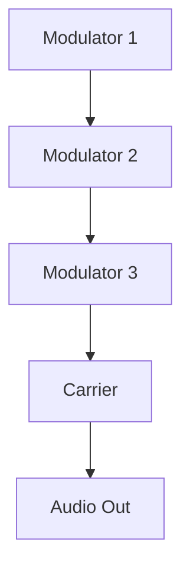

# Mermaid.js Diagrams for "Pixel & Progression"

This file contains Mermaid.js code for conceptual diagrams. These can be rendered into high-quality SVG or PNG files for the book.

## 1. Organizational Chart: Bedroom Coder vs. Corporate Sound Team

## 2. The "Royal Road" Progression Flow

## 3. Fakebit Signal Chain

## 4. YM2612 Algorithm Example (Algorithm 2)

## 5. SNES SPC700 Signal Path

